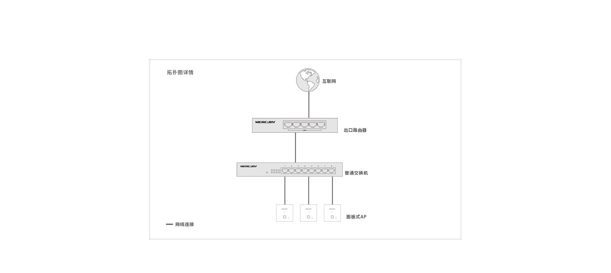
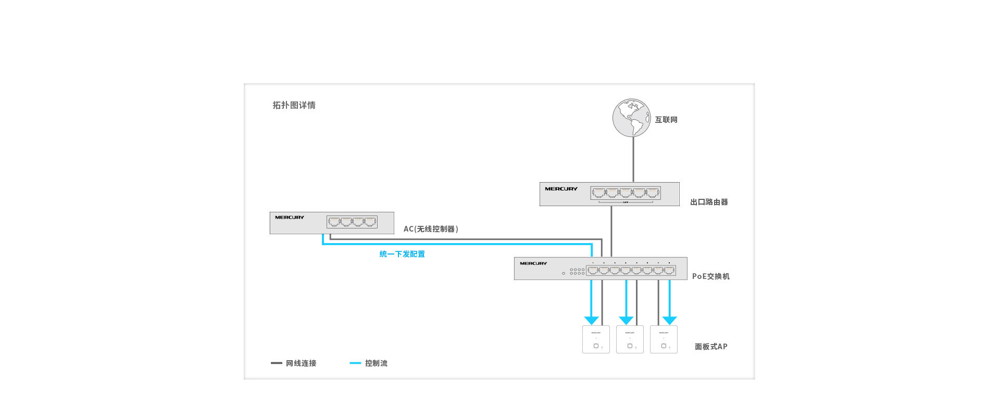
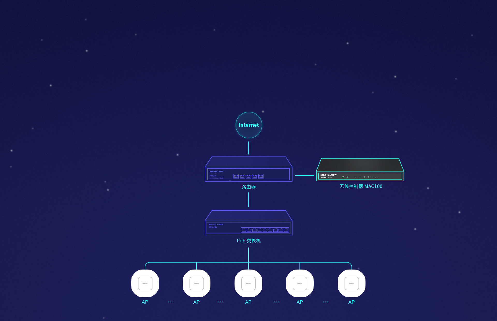
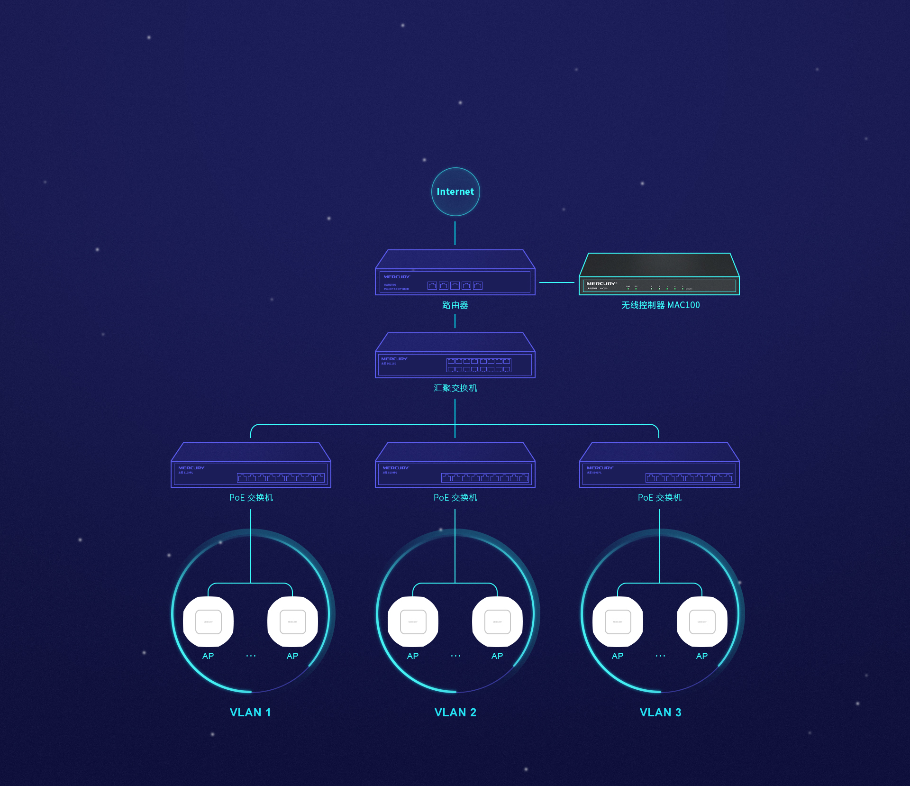

## 家庭WIFI无缝漫游

家庭小面积用，用多个路由器实现（可以理解为瘦AP无AC组网）：
1. 多个路由器，SSID必须都一样，加密方式、密码都一样（除了信道，其他的基本都保持一样）
2. 分别设置不同的信道，那个好用可以用软件（WirelessMon）查看
3. 只有最上层的路由器开启DHCP，下层路由器都当交换机使用（关闭DHCP且将原来WAN口的线插到LAN口）
4. 要实现真正的无缝漫游见： https://zhuanlan.zhihu.com/p/27083768

**胖AP模式部署图**

商业、别墅大面积的，用 AC + 瘦AP 实现（贵）：
1. AC可以统一管理AP（AC可以在网络中连接宽带和局域网，也可以旁路连接）
2. 所有的AP，设置成一样的SSID、认证方式、密码，除了信道
3. AP一般都需要PoE交换机（传输信号且能供电，无需外接电源）
4. AC和AP一般都是同一品牌下的可以自动发现，自动管理
5. 最好使用面板式AP或者吸顶式AP，整洁干净

**AC+瘦AP模式部署图**

AC是如何控制用户端设备接哪个AP的呢？
1. AP自身会获取到一个IP地址，并上报给AC，由此可以在AC中管理
2. AC只是用来管理AP的，AC+路由器+PoE交换机一体的可以做到多种功能，但AC本身只是管理，因此可以旁路连接

**MERCURY_MAC100_旁挂AC组网**

**MERCURY_MAC100_旁挂AC组网,多组交换机**

特别提醒：无线路由器（或AP）千万不要放在金属盒子（盖子）弱电箱里面，基本上不出10米（最多再跨一堵墙）就没信号了，如果实在要放，可以考虑换个ABS塑料盖子。

> 图片来源于水星路由器官网：http://www.mercurycom.com.cn/ ，我个人使用的都是水星路由器和WIFI，推荐使用。

**AP和路由器的区别**
1. 路由器可以理解为胖AP，基本功能差不多，但是AP可能会有更强大的功能
2. 路由器可以理解为瘦AP+DHCP+NAT的组合
3. 瘦AP基本可以理解为一个交换机，功能差不多
4. 稍好一点的AP可以调整信号强度，避免多个AP之间重叠过大导致争抢设备连接

